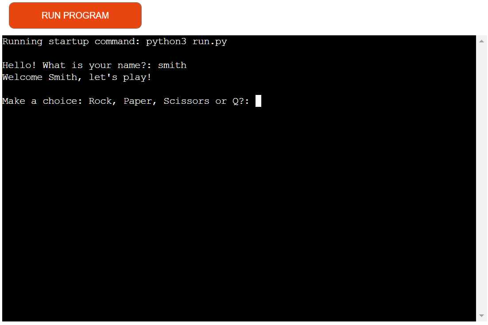

# Python Rock Paper Scissors

#### This classic "Rock Paper Scissors" is a Python terminal game, wich runs is the Code Institute mock terminal on Heroku.

Rock, Paper, scissors is a hand game originating from China.

[Live link to the game can be found here.](https://python-rock-paper-scissors.herokuapp.com/)

## Table of Contents 
1. [Game Rules](#1-game-rules)
2. [Features](#2-features)
3. [Testing](#3-testing)
4. [Deployment](#4-deployment)
5. [Credits](#5-credits)

## 1. Game Rules

This Game is usually played between two people, in which each player simultaneously forms one of three shapes with an outstretched hand. These shapes are "rock" (a closed fist), "paper" (a flat hand), and "scissors" (a fist with the index finger and middle finger extended, forming a V). "Scissors" is identical to the two-fingered V sign (also indicating "victory" or "peace") except that it is pointed horizontally instead of being held upright in the air.

## 2. Features

### Existing Features

- When the game starts, the user is asked to input their name.

    

    
"Hello! What is your name?"

    
    

- A valid name format is required that must be formed of letters only.

    

    
"Do not use numbers or spaces!"

    
    

- Once a valid name is provided, the user is asked to choose one of the following options: Rock, Paper, Scissors or Q (Quit).

    

    
Start Game

    
    

- After the game is played and the user chooses to quit, the result will be shown.

    

    
Result

    
    

### Features to implement
-  Add the lizard, wizard and spock

## 3. Testing

I have manually tested this project by:
* Passing it through PEP8 linter and confirm that everything is all right.
* Giving invalid inputs: numbers where strings are required etc.

## 4. Deployment

This project was deployed using Code Institute's mock terminal to Heroku.

* Steps for deployement:

    * Clone this repository.
    * Create new Heroku App.
    * Set the buildbacks to Python and NodeJS.
    * Link the Heroku App to the repository.
    * Click on Deploy.

## 5. Credits

* Code Institute for the deployment terminal.
* [Tim Ruscica](https://github.com/techwithtim) for better understanding and use of Python.
* [Wikipedia](https://www.wikipedia.org/) for details about the game.
